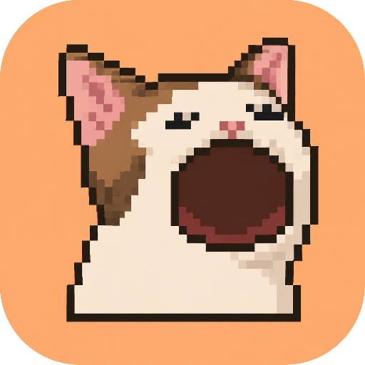
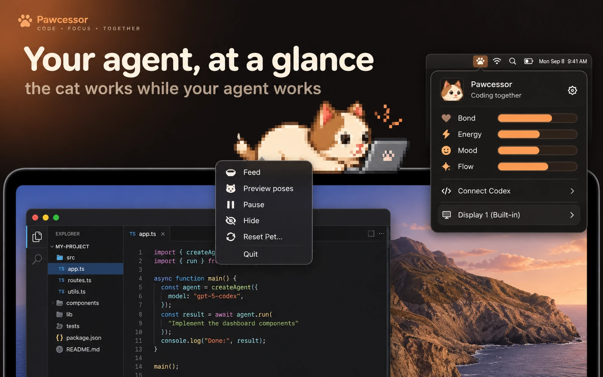
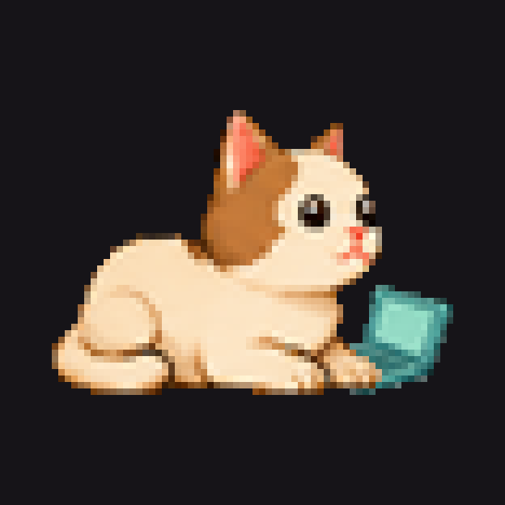
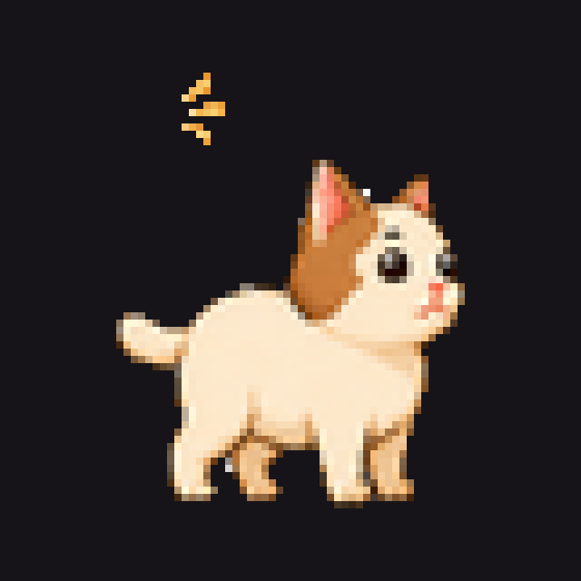
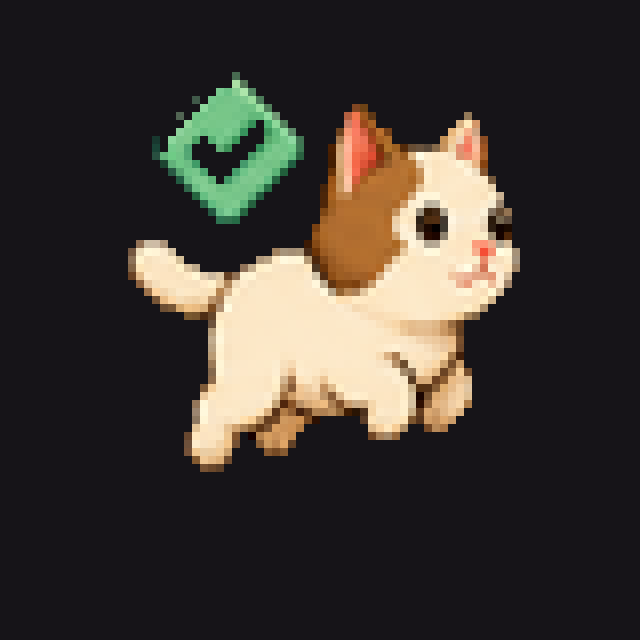
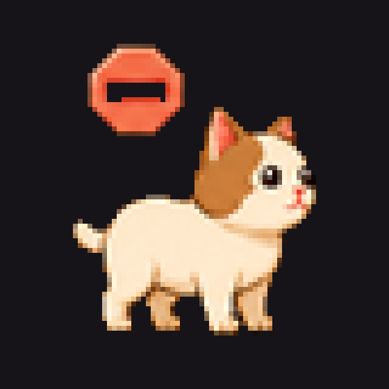
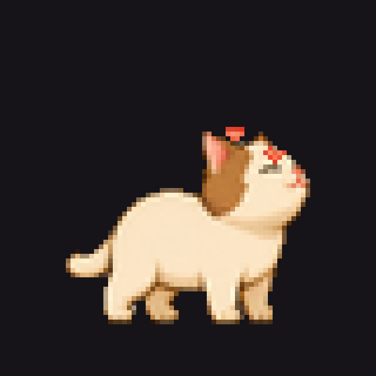
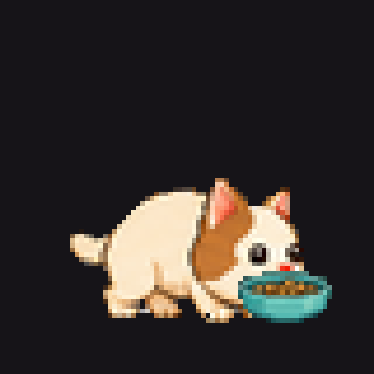

  

<h1 align="center">Pawcessor</h1>

  <strong>Your tiny coding familiar for macOS.</strong> 
  A pixel cat that lives on the desktop, works when your agent works, 
  and stays out of the way while you type.

  <a href="https://github.com/SemiAutomat1c/pawcessor-app/releases/latest/download/Pawcessor-macos.zip"><strong>Download for Mac</strong></a>
  &nbsp;·&nbsp;
  <a href="https://semiautomat1c.github.io/pawcessor-app/">Website</a>

  

---

This repo is the **public download page and Mac zip**. The app source stays private while this preview is unsigned.

Pawcessor is a native menu-bar accessory: no Dock icon, no app-switcher entry, no focus steal. Glance at the cat instead of flipping back to the agent window.

## Download

macOS 14 or later. Universal zip (Apple Silicon and Intel), about 4 MB. Ad-hoc signed, **not notarized**.

1. Unzip `Pawcessor-macos.zip` and drag `Pawcessor.app` into Applications.
2. Control-click the app and choose **Open**. Confirm Open if macOS asks.
3. If you still see “Not Opened”, go to System Settings, Privacy & Security, then Open Anyway.

Mac only for now. Want a Windows version? [Let me know](https://github.com/SemiAutomat1c/pawcessor-app/issues/new?title=Windows%20version).

The pawprint extra is a tiny inspector (care stats, Connect Codex, display). Right-click the cat for Feed, Preview poses, Pause, Hide, Reset, and Quit. Click the cat to pet it. After Hide, use **show** on the inspector.

## What you see

| Pose | Meaning |
| --- | --- |
|  Laptop, sphinx | An agent is **working** |
|  Alert, ears up | **Needs input** |
|  Short hop, badge | **Done**, waiting for you |
|  Soft recovery | **Blocked** or failed |
|  Hearts | You just **pet** it |
|  Bowl | You just **fed** it |

Care is Tamagotchi-light: Bond, Energy, Mood, and Flow. Skipping a meal only softens Mood. The pet cannot die, get sick, or run away.

## Privacy

Local only. No accounts, no analytics, no internet sockets.

- Optional **Orca** support reads one private status file on your Mac. Prompts and code stay unread.
- **Connect Codex** (off by default) installs a user-level hook you trust in Codex `/hooks`. Prompts and code are never stored.
- VS Code, Cursor, Claude, and Antigravity are presence only.
- No Accessibility, Input Monitoring, Screen Recording, camera, or microphone.

## Releases

Download **`Pawcessor-macos.zip`** from [Releases](https://github.com/SemiAutomat1c/pawcessor-app/releases/latest).

GitHub also attaches automatic “Source code” zip/tar files to every release. Those are **this landing repo** (HTML, CSS, icons), not the Swift app.

Made by Ryan Deniega.
